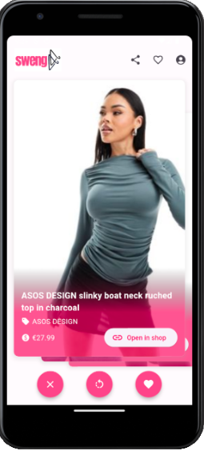
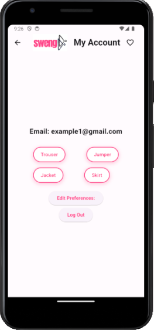

# SWENG
Me and my team created SWENG, a mobile application that brings a Tinder-like swiping experience to clothing shopping. Users swipe right on items they like and left on those they don't, making the fashion selection process both fun and efficient. The app is designed for both iOS and Android using Flutter, with a Python-powered backend and an adaptive learning algorithm. This sophisticated system analyses user choices, taking into account preferences in sizes, colours, and styles. By tracking swipes, the algorithm learns individual tastes, continuously improving the accuracy of the items displayed to the user.

