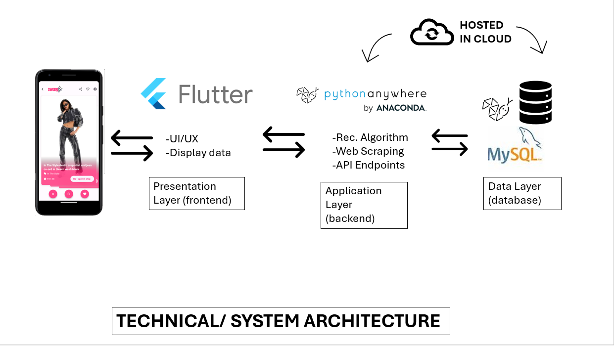

# Executive Summary / Introduction</apan>

Sweng is an innovative mobile application poised to disrupt the fashion retail market by merging the intuitive swipe mechanics popularized by dating apps with a powerful shopping and recommendation platform. Designed with a "Tinder-style" user interface, Sweng offers a fresh take on online clothing shopping, allowing users to quickly swipe through an array of fashion items, swiping right to add them to their wishlist, and left to pass.

Upon signing up, users are prompted to select their style preferences, which Sweng's algorithm uses to curate a personalized fashion feed. This bespoke experience is further refined with each swipe, as the app learns from the user's choices, continually honing its recommendations. The wishlist serves not just as a collection of favored items, but also as the foundation for a sophisticated recommendation algorithm that suggests new pieces and styles, tailored to the user's tastes.

Sweng's core objective is to streamline the online shopping experience, making it more engaging and personalized. The app's convenience is heightened by direct links to purchase items, simplifying the transition from discovery to acquisition. This feature ensures that users are only a few taps away from owning their next favorite piece of clothing.

An additional layer of customization is provided at the onset, where users can set preferences for the types of styles they like. Whether they're into streetwear, high fashion, or vintage, Sweng adapts its showcase to match their sartorial leanings, ensuring a highly relevant and customized browsing experience.

In the current e-commerce landscape, Sweng stands out with its unique combination of simplicity, personalization, and direct purchasing links. As users interact with the app, their swiping patterns yield valuable data, enabling Sweng to continuously refine its algorithms, and ensuring that the user's feed remains relevant and engaging. This dynamic approach to online shopping not only fosters a more enjoyable user experience but also drives higher conversion rates for retailers.

Moving forward, Sweng is positioned to become an essential tool for fashion-forward consumers and a valuable partner for retailers seeking to captivate and convert an engaged audience. Through strategic partnerships, continuous algorithmic refinement, and an unwavering commitment to user experience, Sweng aims to redefine how consumers discover and purchase fashion online.

## Market Research

### Industry Analysis
The fashion industry is an ever-evolving landscape characterized by its fast pace and its susceptibility to consumer trends and global economic conditions. In recent years, the rise of e-commerce has dramatically shifted the dynamics of purchasing behavior, with a significant proportion of consumers opting for the convenience and variety offered by online platforms. The advent of mobile shopping apps has further augmented this trend, with apps like Sweng leading the charge in offering personalized, on-demand fashion retail services.

The growing influence of social media on fashion has created a new cohort of trendsetters and style influencers, shaping consumer preferences and expectations. Brands are increasingly turning to these platforms to market their products, making the social-media-integrated shopping experience offered by apps like Sweng not just innovative, but necessary.

### Target Market Demographics and Psychographics
Sweng's primary target market consists of Millennials and Gen Z consumers aged between 18 and 35. This demographic is tech-savvy, highly engaged with social media, and values convenience and personalization in their shopping experience. They prefer platforms that offer a seamless blend of entertainment and shopping, a niche Sweng fills with its swipe-to-shop feature.

Psychographically, Sweng appeals to fashion-forward individuals who enjoy exploring and experimenting with their style. These consumers appreciate a platform that learns their preferences and presents them with options that resonate with their personal taste. They are also environmentally and ethically conscious, often looking for brands that align with their values.

### Competitive Analysis
Sweng operates in a highly competitive market, with direct competition coming from established e-commerce giants as well as niche fashion apps. Platforms like Amazon and ASOS offer vast selections and convenience but lack the personalized shopping experience Sweng provides. On the other hand, subscription-based services like Stitch Fix provide personalization but require a commitment that casual shoppers may shy away from.

Sweng differentiates itself with its combination of a low-commitment, personalized browsing experience and its unique swipe interface that leverages the habitual behavior modeled by dating apps. Its AI-driven recommendation engine not only keeps users engaged but also offers a valuable tool for discovering new trends and products without the need to sift through overwhelming inventory.

To maintain a competitive edge, Sweng must continue to innovate, ensuring that its algorithm stays ahead of the curve in predicting and adapting to user preferences. Strategic partnerships with emerging and established fashion brands will enhance its product offerings and appeal to a broader user base. Additionally, Sweng can capitalize on the data-driven insights it garners to assist brands in understanding emerging trends, thereby positioning itself as a valuable partner to retailers.

In summary, Sweng is positioned at the intersection of technology and fashion, catering to a demographic that values the convergence of both. To thrive, Sweng must constantly evolve, recognizing shifts in consumer behavior and the industry's technological advances. By doing so, Sweng will not only retain its relevance but also set new standards in the online fashion retail space.

## Concept Development
The development of Sweng began with a clear vision: to simplify and enhance the online shopping experience using the familiar mechanics of dating apps. In the digital age, where consumer attention spans are short and the desire for instant gratification is high, Sweng was conceptualized to marry the convenience of e-commerce with the addictive, fun element of swiping through options.

### Ideation Phase
The ideation phase revolved around the central question: How can we make online shopping as easy and enjoyable as swiping right? The answer lay in the development of an application that leveraged the intuitive swipe functionality to allow users to quickly navigate through clothing options. A 'right swipe' would indicate interest and save the item to a wishlist, while a 'left swipe' would dismiss it, thus offering a streamlined, binary decision-making process that could capture the fleeting attention of the modern consumer.

### Addressing User Pain Points
Market research identified key user pain points in existing shopping apps, such as overwhelming choice, difficulty in tracking preferred styles, and a lack of personalized recommendations. Sweng was envisioned as a solution to these challenges, introducing a recommendation system that adapts to user preferences over time. This system would not only curate a personalized shopping feed but also help users discover new trends and styles aligned with their tastes, effectively acting as a digital personal shopper.

### User-Centric Design
The design phase placed heavy emphasis on user engagement. Sweng’s interface was crafted to be minimalist yet functional, ensuring that the focus remained on the fashion items themselves. This design philosophy extended to the app’s onboarding process, which was made straightforward and inviting. New users would be greeted by a series of style preference choices, which immediately immerse them in the personalization experience that Sweng offers.

## Design Process
The design process of Sweng, a sophisticated fashion shopping app, was centred around creating a seamless, user-friendly experience, leveraging advanced technologies, and integrating a set of rich features. Here’s how the app was designed from the ground up:

### Technical Architecture
The Technical Architecture of our app is designed to separate concerns into distinct layers and use appropriate technologies for each, this allows for modularity, scalability and maintainability. The architecture is designed to facilitate efficient data flow, responsive user experience and communication between components.

**Presentation layer (Frontend)** - this layer is responsible for presenting the user interface (UI) to the app users, the Flutter frontend serves as the presentation layer, handling user interactions, displaying data and providing a seamless user experience, this layer interacts with the backend layer to request and receive data.

**Application layer (Backend)** - this layer contains the implementation logic of our app and processes the requests received from the frontend, the Python backend hosted on PythonAnywhere serves as the application layer, it handles tasks like web scraping, data processing, recommendation algorithm and serving API endpoints to communicate with the Frontend.

**Data layer (database)** - this layer manages the storage and retrieval of data used by the application. The database hosted by PythonAnywhere serves as the data layer, it stores the collected data obtained through web scraping and provides this data for processing and retrieval by the backend server.

These layers of the Technical Architecture work together to enable the functionality of SWENG.

### Recommendation Algorithm Development (Peace)
A pivotal aspect of Sweng's concept development was the creation of a sophisticated algorithm capable of learning and evolving with each user interaction. The app’s engine was designed to analyze swipes, wishlist additions, and purchase history to refine and personalize the product feed. This continuous learning process ensures that users remain engaged with the content that is most relevant to them, increasing the likelihood of purchase conversions.

The heart of Sweng lies in its recommendation algorithm. Designed to mimic the intuitive and engaging experience of dating apps, Sweng's algorithm uses machine learning to analyse user interactions—swipes, likes, wishlist additions—and tailor the shopping experience to individual tastes. 
When building the recommendation Algorithm I researched various machine learning libraries in Python that could be used for building recommendation systems. I also researched the different types of recommendation systems like content-based,collaborative-filtering and hybrid systems. The main functionality of our recommendation algorithm was to be given information about the items that a user likes and then recommend something similar, this was done using a Python library called scikit-learn, which used things like term frequency and cosine similarity of terms used to describe an item to find other items that were similar to it, it then returned the recommended item in JSON format.

    from sklearn.feature_extraction.text import TfidfVectorizer #TF-> term frequency used for calculating similarities in texts
    from sklearn.metrics.pairwise import linear_kernel

    #preprocess data
    asos_df = pd.read_csv('data.csv')
    tfidf = TfidfVectorizer(stop_words='english')#remove english stop words eg. and, in, but etc.
    #build vector space model, for each product in the asos dataframe
    tfidf_matrix = tfidf.fit_transform(asos_df['name'])
    #cosine similarity, reference each product with another for pairwise similarity checking
    cosine_sim = linear_kernel(tfidf_matrix, tfidf_matrix) #linear kernel is a mathematical function used to measure the similarity between two things
    indices = pd.Series(asos_df.index, index = asos_df['name']).drop_duplicates() #used to get product name and index pair groupings
    #use indices in recommendation alg. function to find recommendations based on product details

By continuously learning from user behaviour, the algorithm refines its suggestions, making each user's feed more personalized over time.

### Server and Backend (Peace)
The backend of Sweng is hosted on PythonAnywhere, a cloud service platform that allows for easy Python web app hosting. This choice was made for its simplicity and effectiveness in deploying Python applications quickly. The server-side logic is implemented in Python, taking advantage of its rich ecosystem, including libraries for machine learning, data processing, and API development.
The logic behind the app is hosted on the server(backend) and it serves API endpoints for the frontend to interact with.

    https://sweng1.pythonanywhere.com/
    https://sweng1.pythonanywhere.com/recommend/[product data]
    https://sweng1.pythonanywhere.com/random

### Data Collection (Peace)
In the process of developing our app, data collection played a pivotal role in providing relevant content for the execution of our fashion-related app. 
When collecting fashion-related data for the app I chose to use Python due to its various libraries for web scraping, such as Beautiful Soup, scrapy, selenium and requests. Initially, I tried using Beautiful Soup and Selenium to extract the data but unfortunately, I was met with many blockers that prevented me from accessing the data I needed. Eventually, I used the requests-html library which allowed me to simulate HTTP requests, and parse the content to extract what I needed.

    response = requests.get('https://www.asos.com/api/product/search/v2/categories/27108', headers=headers, params=params)
    result_json = response.json() #json object containing webscraped data
    
I decided it was best to utilize web scraping to extract fashion-related data from an e-commerce website(ASOS). The data extraction process was executed on our server, the data was then processed and stored in a database on the server. Upon extraction the data was filtered and processed to ensure it was suitable for integration with our app which was built using Flutter, this integration ensured that our app could dynamically access and display up-to-date fashion content.

### Database Management with MySQL (Eimear)
Sweng’s data storage solution utilizes MySQL, a robust and reliable relational database management system. MySQL stores user profiles, product information, wishlist data, and interaction logs. This choice supports complex queries and scales well with the growing amount of data, crucial for the app’s learning algorithms and for providing a fast, responsive user experience. 

The database utilized in the system is supported by the database_helper.dart file. This file is comprised of classes and related functions that provide a consistent and robust structure for SQL fetch and insert statements. Each table in the database is initialized and has its columns defined in the initDatabase() function. This method is called in the main.dart file, and other relevant dart files, to facilitate insertion and fetching according to the needs of the application i.e. in terms of signups/preferences. In initDatabase() each table is created using a standard ‘CREATE’ statement, with relevant keys being connected using FOREIGN KEY where necessary e.g. between the wishlist and users tables. 

With Flutter, migrations through database versions must be performed each time a new table is introduced. In the case of our application, no migrations were needed for the ‘users’ as it was the first table to populate the DB but upgrades were necessary for ‘wishlist’ and ‘preferences’. Upgrade functions use an ‘ALTER’ statement and check for the current version number to perform the migration. 

There are INSERT methods for each table along with User and Preference classes that are used as objects when adding to the DB. In turn, there are get methods for users, preferences and the wishlist that query the database based on IDs and usernames. 
There is added security through the use of prepared SQL statements. They are structured using ‘?’ fields rather than inserting straight from the parameter of the function to the database. This avoids the risk of a ‘DROP TABLE’ statement from disrupting the tables in the DB. 

### Front End Development with Flutter (Yaz & Roisin)
The frontend of Sweng was developed using Flutter, Google's UI toolkit for crafting natively compiled applications for mobile, web, and desktop from a single codebase. Flutter was chosen for its fast development cycle, expressive and flexible UI, and native performance. It allows Sweng to offer a smooth, aesthetically pleasing user experience across iOS and Android platforms.

Flutter supports development in Dart, a client-optimized language for fast apps on any platform. Dart’s features—such as hot reload, a rich standard library, and strong UI-oriented features—make it an ideal choice for Sweng’s development.

#### Key Features
1. **Interactive Card Swiping**: Users can swipe left, right or down to indicate their preference for candidate items.
2. **Dynamic Data Loading**: Candidate items are fetched dynamically from a remote API, on our server, ensuring fresh content for users.
3. **User Engagement**: Users can interact with candidate items by tapping on them to view details or add them to their wishlist.
4. **Local Database**: User preferences and wishlist items are stored locally, providing seamless access across sessions.

#### Application Flow
The Flutter application offers a seamless user experience with the following flow:

1. **Authentication**: Users are directed to the login page upon launching the app. If they have no account they can navigate to the sign up page. This allows them to create a new account and then add their preferences. 
2. **Navigation**: After authentication, users navigate to the example page where they can interact with candidate items.
3. **Data Fetching**: Candidate data is fetched dynamically from a remote API, on our server, using HTTP requests.
4. **User Interaction**: Users can swipe through candidate items, view details, and add items to their wishlist.
5. **Persistence**: User preferences and wishlist items are stored locally in a database for future sessions.

The Flutter application follows a modular structure, with each component serving a specific purpose:

##### 1. main.dart:(Swiping and main Functions)
Entry point of the application. Initializes the Flutter app and defines routes for navigation.
    void main() async {
    WidgetsFlutterBinding.ensureInitialized();
    // Initialize the database
    await initDatabase();

    runApp(
    const MaterialApp(
        debugShowCheckedModeBanner: false,
        home: MyApp(),
    ),
    );
    }
    class MyApp extends StatelessWidget {
    final User? user;

    const MyApp({Key? key, this.user}) : super(key: key);

    @override
    Widget build(BuildContext context) {
    return MaterialApp(
        debugShowCheckedModeBanner: false,
        initialRoute: '/login',  // Set initial route to login
        routes: {
        '/login': (context) => const LoginPage(),
        '/example': (context) => Example(user: user),
        '/wishlist': (context) => WishlistScreen(user: user),
        '/account': (context) => AccountPage(user: user),
        },
    );
    }
    }

The main function initializes the Flutter application. It ensures that Flutter's bindings are initialized, then initializes the database by calling the initDatabase function asynchronously. Finally, it runs the main application using runApp, which creates an instance of MaterialApp with the provided configurations and sets MyApp as the home screen.

Main.dart also contains the ExamplePage which acts as the main page for the application. It controls the card swiper and main functions of the application.

**`_ExamplePageState` Class**

    class _ExamplePageState extends State<Example> {
    final CardSwiperController controller = CardSwiperController();
    int currentIndex = 0;

    late Future<List<ExampleCandidateModel>> futureCandidates;
    late List<ExampleCandidateModel> candidates; // Define candidates here
    @override
    void initState() {
    super.initState();
    futureCandidates = fetchData();
    candidates = [];
    
    }

    @override
    void dispose() {
    controller.dispose();
    super.dispose();
    }

_ExamplePageState is the state class for the Example widget. It manages the state of the widget. The main card swiper functionality is implemented using the flutter card swiper package.  It initializes a CardSwiperController named controller for controlling the card swiper. It initializes currentIndex to keep track of the index of the currently displayed card. In initState, it initializes futureCandidates by calling the fetchData function and initializes candidates as an empty list. It overrides the dispose method to dispose of the controller when the state is disposed of.

**`ExampleCandidateModel`**

    class ExampleCandidateModel {
    final String name;
    final String image;
    final String link;
    final String price;
    final String brand;

    ExampleCandidateModel({
    required this.name,
    required this.image,
    required this.link,
    required this.price,
    required this.brand,
    });
    }

This class represents a model for candidate items. It has five properties: name, image, link, price, and brand, all of which are required. The constructor ExampleCandidateModel initializes these properties when an object of this class is created. THis allows us to store information about each item in an object that can be stored in a list.

**`fetchData` Method**

    Future<List<ExampleCandidateModel>> fetchData() async {
    try {
    // Fetch JSON data from the URL
    final response = await http.get(Uri.parse('https://sweng1.pythonanywhere.com'));
    if (response.statusCode == 200) {
        // Parse the JSON data
        final List<dynamic> jsonData = jsonDecode(response.body);

        // Create a list of ExampleCandidateModel instances
        final List<ExampleCandidateModel> parsedCandidates = jsonData.map((item) {
        return ExampleCandidateModel(
            name: item['name'],
            image: item['image'],
            link: item['link'],
            price: item['price'],
            brand: item['brand'],
        );
        }).toList();
        
        // Retrieve user preferences
        Preference? pref = await getUserPreferences();
        
        // Filter candidates based on user preferences
        final filteredCandidates = parsedCandidates.where((candidate) =>
            candidate.name.toLowerCase().contains(pref!.preference1.toLowerCase()) ||
            candidate.name.toLowerCase().contains(pref.preference2.toLowerCase()) ||
            candidate.name.toLowerCase().contains(pref.preference3.toLowerCase()) ||
            candidate.name.toLowerCase().contains(pref.preference4.toLowerCase())
        ).toList();

        // Insert filtered candidates to the start of the list
        candidates.insertAll(0, filteredCandidates);

        // Check if the list size is at least 10
        if (candidates.length < 5) {
        // Fill the remaining slots with additional candidates fetched from the API
        final remainingCandidates = parsedCandidates.where((candidate) => !filteredCandidates.contains(candidate)).toList();
        candidates.addAll(remainingCandidates.take(10 - candidates.length));
        }

        return candidates;
    } else {
        throw Exception('Failed to load data: ${response.statusCode}');
    }
    } catch (e) {
    print('Error fetching data: $e');
    // Handle the error gracefully, e.g., show a friendly error message to the user
    return []; // Return an empty list if an error occurs
    }
    }

The `fetchData` method is responsible for fetching data from an API endpoint. It returns a Future<List<ExampleCandidateModel>> representing a list of candidate models that will be used in the card swiper by the controller. It performs an HTTP GET request to fetch JSON data from the specified URL. To do this it uses the http flutter package which fetches the json data from our server(backend). It parses the JSON data and creates ExampleCandidateModel instances from it. It filters candidates based on user preferences and ensures that the list size is at least 5. This makes sure that the user will never run out of candidates and that the first items they are shown are related to their preferences.

**`getUserPreferences` Method**

    Future <Preference?> getUserPreferences() async {
    try {
    final DatabaseHelper databaseHelper = DatabaseHelper();
    final User? user1 = ModalRoute.of(context)?.settings.arguments as User?;

    return await databaseHelper.getPref(user1!.username);
    
    } catch (e) {
    debugPrint('Error getting user preferences: $e');
    // Handle the error gracefully
    }
    }

The getUserPreferences method is responsible for retrieving user preferences from the database. It returns a Future<Preference> representing the user's preferences.It uses the DatabaseHelper to fetch user preferences from the preference table based on the current user's username.

**`build` Method**

    @override
    Widget build(BuildContext context) {
    final User? user1 = ModalRoute.of(context)?.settings.arguments as User?;
    
    return Scaffold(
        // returns UI elements for the main example page
            
        body: SafeArea(
        
        child: FutureBuilder<List<ExampleCandidateModel>>(
            future: futureCandidates,
            builder: (context, snapshot) {
            if (snapshot.connectionState == ConnectionState.waiting ) {
                return const Center(child: CircularProgressIndicator());
            } else if (snapshot.hasError) {
                return Center(child: Text('Error: ${snapshot.error}'));
            } else {
                candidates = snapshot.data ?? [];
                return _buildCardSwiper(candidates);
                
            }
        },
        ),
    ),
    );
    }

This method builds the UI for the page. It returns a `Scaffold` widget, which provides the overall structure for the page, including the app bar and body. In the app bar, it displays the logo, share button, wishlist button, and account button. To combat the problem of the UI trying to build its tree before it has fetched all the data we use a FutureBuilder widget.  The `FutureBuilder` widget, asynchronously builds a widget tree based on the latest snapshot of interaction with a `Future`. If the future is still loading, it shows a circular progress indicator. If there's an error, it displays an error message. Otherwise, it builds the card swiper widget using `_buildCardSwiper` method.

**`_buildCardSwiper` Method**

    Widget _buildCardSwiper(List<ExampleCandidateModel> candidates) {
    return Column(
        children: [
        Flexible(
            child: CardSwiper(
            controller: controller,
            cardsCount: candidates.length,
            onSwipe: _onSwipe,
            onUndo: _onUndo,
            numberOfCardsDisplayed: 3,
            backCardOffset: const Offset(40, 40),
            padding: const EdgeInsets.all(15.0),
            cardBuilder: (
                context,
                index,
                horizontalThresholdPercentage,
                verticalThresholdPercentage,
            ) =>
                ExampleCard(candidates[index]),
    ...
This method constructs the card swiper widget. It returns a `Column` widget containing the card swiper and action buttons. The card swiper is implemented using a `CardSwiper` widget, from the card swiper package, which is fed with data from the `candidates` list. Below the card swiper, it displays action buttons for swiping left, swiping right, and undoing the swipe action.

**`_onSwipe` method**

    int swipeCount = 0;

    bool _onSwipe(
    int previousIndex,
    int? currentIndex,
    CardSwiperDirection direction,
    ) {
    debugPrint(
    'The card $previousIndex was swiped to the ${direction.name}. Now the card $currentIndex is on top',
    );

    final User? user1 = ModalRoute.of(context)?.settings.arguments as User?;

    if (direction == CardSwiperDirection.top) {
    // Navigate to the details page when swiped to the top
    _navigateToDetailsPage(candidates[previousIndex!]);
    return false;
    } else if (direction == CardSwiperDirection.left) {
    fetchAndAddRandom();
    controller.swipeLeft(); // Handle left swipe
    if (currentIndex != null) {
        this.currentIndex = currentIndex;
    }
    } else if (direction == CardSwiperDirection.right) {
    fetchAndAddRecommendation(candidates[previousIndex!]);
    addToWishlist(candidates[previousIndex!], user1);
    controller.swipeRight(); // Handle right swipe
    if (currentIndex != null) {
        this.currentIndex = currentIndex;
    }
    }

    debugPrint('New currentIndex: $currentIndex');
    debugPrint('Candidates length: ${candidates.length}');

    return true;
    }

To implement the main swiping functionality and incorporate the recommendation algorithm we use the onSwipe method. 

This method is invoked when a card in the swiper widget is swiped. It takes the previous index of the card, the current index (which could be null), and the direction of the swipe. Based on the direction of the swipe, it performs different actions:
  - If swiped to the top, it navigates to the details page of the selected item.
  - If swiped to the left, it fetches and adds a **random recommendation**, using the `fetchAndAddRandom` method, and adds to the list of cards, then handles the swipe left action.
  - If swiped to the right, it fetches a **recommendation**, using the `fetchAndAddRecommendation` method, and adds the swiped item to the user's wishlist,using the `addToWishlist` method, then handles the swipe right action.
- It updates the `currentIndex` variable and returns true to indicate that the swipe action was handled.

**`_onUndo` method**

    bool _onUndo(
    int? previousIndex,
    int currentIndex,
    CardSwiperDirection direction,
    ) {
    debugPrint(
        'The card $currentIndex was undid from the ${direction.name}',
    );
    if (currentIndex != null) {
        this.currentIndex = currentIndex;
    }
    return true;
    }

We also implemented an undo function, allowing the user to see a card they have previously swiped away. This method is invoked when the user decides to undo a swipe action. 

**`addToWishlist` method**

    void addToWishlist(ExampleCandidateModel candidate, User? user) async {
    // Obtain the user ID from the database or any other source
    if (user != null) {
    final DatabaseHelper databaseHelper = DatabaseHelper();
    // Check if the item is already in the wishlist
    final existingItems = await databaseHelper.getWishlistItems(user.id);
    for (var item in existingItems) {
        if (item == candidate) {
            debugPrint('Item already exists in the wishlist!');
            return;
        }
    
    
    }
    // If the item is not in the wishlist, add it
    databaseHelper.insertWishlistItem(user.id, candidate);
    debugPrint('Item added to wishlist!');

    }
    }

This method allows a user to add a candidate item to the user's wishlist. It takes the candidate item and the user as parameters, this makes sure the item is being added to that user's wishlist. It accesses the database using the DatabaseHelper. It first checks if the item already exists in the user's wishlist, this combats our earlier issue of the same item being added twice. To do this we had to override the “==’ in the candidate model class.

**== Operator Override:**

    @override
    bool operator ==(Object other) {
    if (identical(this, other)) return true;

    return other is ExampleCandidateModel &&
        other.name == name &&
        other.image == image &&
        other.link == link &&
        other.price == price &&
        other.brand == brand;
    }

This overrides the == operator to compare two ExampleCandidateModel objects for equality. It checks if the other object is of type ExampleCandidateModel and if all properties of both objects are equal. Making sure no duplicates are added. 

**`fetchAndAddRecommendation` method**

    void fetchAndAddRecommendation(ExampleCandidateModel candidate) async{
    
        try {
        // Construct URL for recommendation
        String recommendationUrl = 'https://sweng1.pythonanywhere.com/recommend/${candidate.name}';
        // Fetch recommendation from the URL
        // . . . 
    
    }

This method fetches a recommendation for a given candidate item. It constructs the URL for the recommendation API endpoint based on the candidate's name, therefore returning a recommendation based on that candidate. This is the basis of our recommendation function. Each time a card is swiped right a recommendation based on that card is added. 

**`fetchAndAddRandom` method**

    void fetchAndAddRandom() async {
        try {
        // Construct URL for recommendation with query parameter for number of items
        String randomUrl = 'https://sweng1.pythonanywhere.com/random';
        // Fetch recommendation from the URL
        // . . .
        }

This method is used when a card is swiped left, it fetches random items from an API endpoint.. It sends a GET request to the random items URL on our server and waits for the response. This Url returns a list of random JSON candidates from our server. It parses the JSON data to create `ExampleCandidateModel` instances representing the random items. It checks if each random item is not already in the list of candidates, and if not, it adds the item to the list and updates the UI using `setState`.

This entire setup enables users to interact with a card swiper interface, where they can swipe left or right on cards representing items, view details, add items to their wishlist, and receive recommendations based on their interactions.

##### 2. example_card.dart: (Individual item cards)
This page Implements the UI for displaying the individual candidate cards. It uses the candidate model to display different information about an item to the user such as, name, brand, price. It also contains a button allowing the user to open the item in the original store. 

    @override
    Widget build(BuildContext context) {
    return Container(
    clipBehavior: Clip.hardEdge,
    decoration: BoxDecoration(
    borderRadius: BorderRadius.circular(10),
    color: Colors.white,
    boxShadow: [
        BoxShadow(
        color: Colors.grey.withOpacity(0.2),
        spreadRadius: 3,
        blurRadius: 7,
        offset: const Offset(0, 3),
        ),
    ],
    ),
    child: Stack(
    fit: StackFit.expand,
    children: [
        Image.network(
        candidate.image,
        fit: BoxFit.cover,
        ),
    // Other UI elements like text and buttons are positioned on top of the image
    ],
            ), 
        ); 
        }

It consists of a container with rounded corners, containing an image and other UI elements positioned on top of the image using a `Stack`.

**`Launch URL` method**

    Future<void> _launchURL(String url) async {
    // const url2 = "https://flutter.io";
    final Uri _url = Uri.parse(url);
    if (!await launchUrl(_url)) {
    throw Exception('Could not launch $_url');
    }
    }

This method asynchronously launches a URL using the url_launcher package. It takes a URL as input and attempts to launch it. If the URL cannot be launched, it throws an exception. Here it takes the link from the candidate model to open the item in the original store.

**`DetailsPage` Widget**

    class DetailsPage extends StatelessWidget {
    final ExampleCandidateModel candidate;
    final CardSwiperController? controller;
    // final CardSwiperController controller = CardSwiperController();

    const DetailsPage({Key? key, required this.candidate, this.controller}) : super(key: key);
    @override
    Widget build(BuildContext context) {
    return Scaffold(
        
        body: CustomScrollView(
        slivers: [
            SliverAppBar(
            expandedHeight: 400.0,
            flexibleSpace: FlexibleSpaceBar(
                background: Image.network(
                candidate.image,
                fit: BoxFit.cover,
            // Other UI elements like text and buttons are displayed 
            ]
        )
    }

This method builds the UI for the details page. This is navigated to when a card is swiped to the top. 
It uses a `CustomScrollView` with `SliverAppBar` to create a collapsible app bar with a background image. Additional UI elements like text and buttons are displayed using `SliverFillRemaining`.

In summary, `ExampleCard` is a widget for displaying a card representing a candidate item, while `DetailsPage` is a widget for displaying detailed information about a candidate item. Both widgets use the provided `ExampleCandidateModel` object to populate their UI with relevant data.

##### 3. account_page.dart:
This page represents the account page, which displays user account details and preferences.

    class _AccountPageState extends State<AccountPage> {
    late String? email;
    late String pref1 = '';
    late String pref2 = '';
    late String pref3 = '';
    late String pref4 = '';
    @override
    void initState() {
    super.initState();
    loadAccountDetails();
    }

The state class `_AccountPageState` manages the state for the `AccountPage` widget. It initializes variables to store user email and preferences. The `initState` method is overridden to load the user's account details when the widget is initialized.  Each user should have 4 preferences they have picked on sign up and they are able to edit these preferences on this account page.

**`loadAccountDetails()` method**

    void loadAccountDetails() async {
    email = widget.user?.username;
    debugPrint('User email: $email');

    final DatabaseHelper databaseHelper = DatabaseHelper();
    Preference? preference = await databaseHelper.getPref(widget.user!.username);
    if (preference != null) {
        setState(() {
        pref1 = preference.preference1;
        pref2 = preference.preference2;
        pref3 = preference.preference3;
        pref4 = preference.preference4;
        });
        debugPrint('Preferences: $pref1, $pref2, $pref3, $pref4');
    } else {
        debugPrint('Preferences not found.');
    }
    }

`loadAccountDetails` method loads the user's account details asynchronously. It retrieves the user's email from the provided `user` object and queries the database for preferences using `DatabaseHelper`. If preferences are found, it updates the state variables with the retrieved preferences.

    @override
    Widget build(BuildContext context) {
    final user1 = widget.user;
    return 
        // UI for displaying user account details and preferences
        ),
    );
    }

The `build` method constructs the UI for the account page. It displays the user's email in the app bar and preferences using `buildPreferenceBubble` method. It also provides buttons for editing preferences and logging out. The edit preference button navigates the user to the preferences page where they can change their preferences. The logout button logs the user out and navigates them back to the login page.

In summary, the `AccountPage` widget provides a user interface to display account details and preferences. It retrieves user data asynchronously and updates the UI accordingly.

##### 4. login.dart:

This page Implements the login page UI and functionality. Allowing a user to login with their email and password.

    class LoginPage extends StatefulWidget {

    const LoginPage({ Key? key }) : super(key: key);

    @override
    State<LoginPage> createState() => _LoginPageState();
    }

    class _LoginPageState extends State<LoginPage> {
    final TextEditingController emailController = TextEditingController();
    final TextEditingController passwordController = TextEditingController();
    final DatabaseHelper databaseHelper = DatabaseHelper();

    String errorMessage = '';

    @override
    Widget build(BuildContext context) {
    return Scaffold(
        // Login page UI implementation
    );
    }
    }

The state class `_LoginPageState` manages the state for the LoginPage widget. It initializes TextEditingController objects for handling email and password input fields. It also initializes a DatabaseHelper object for interacting with the database. errorMessage is a variable used to store and display error messages related to authentication. The build method constructs the UI for the login page.

**`makeInput` widget**

    Widget makeInput({label, obscureText = false, required TextEditingController controller}) {
    return Column(
        crossAxisAlignment: CrossAxisAlignment.start,
        children: <Widget>[
        Text(
            label,
            style: const TextStyle(
                fontSize: 15, fontWeight: FontWeight.w400, color: Colors.black87),
        ),
        const SizedBox(
            height: 5,
        ),
        TextField(
            obscureText: obscureText,
            controller: controller, // Add this line to associate the controller
            decoration: InputDecoration(
            contentPadding: const EdgeInsets.symmetric(vertical: 0, horizontal: 10),
            enabledBorder: OutlineInputBorder(
                borderSide: BorderSide(color: Colors.grey.shade400)),
            border: OutlineInputBorder(
                borderSide: BorderSide(color: Colors.grey.shade400)),
            ),
        ),
        const SizedBox(
            height: 30,
        ),
        ],
    );
    }

`makeInput` is a helper method used to create input fields for email and password. It takes parameters for label, obscureText (for password field), and controller. It returns a column containing a text label and a text field.

**`MaterialButton` (login validation)**

    MaterialButton(
    onPressed: () async {
    // Get user input
    String email = emailController.text;
    String password = passwordController.text;
    // Validate user credentials
    User? user = await databaseHelper.getUser(email);
    if (user != null && user.password == password) {
        // Navigate to home page if authentication is successful
    } else {
        // Authentication failed
        setState(() {
        errorMessage = 'Incorrect username or password';
        });
    }
    },
    color: const Color.fromARGB(255, 241, 85, 137),
    elevation: 0,
    shape: RoundedRectangleBorder(
        borderRadius: BorderRadius.circular(50)),
    child: const Text(
    "Login",
    style: TextStyle(
        fontWeight: FontWeight.w600,
        fontSize: 18,
        color: Colors.white,
    ),
    ),
    ),

This button is responsible for handling the login process. It retrieves the email and password entered by the user. It validates the user's credentials by querying the database. If the credentials are correct, it navigates to the home page. If the credentials are incorrect, it updates the errorMessage variable to display an error message.

##### 5. signup.dart:

The signup page is implemented in the same way as the login page, however it has extra functionality for validating users and adding new users to the database.

    MaterialButton(
                    minWidth: double.infinity,
                    height: 60,
                    onPressed: () async {// Get user input
                        String email = emailController.text;
                        String password = passwordController.text;
                        String confirmPassword = confirmPasswordController.text;

                        // Validate email format
                        Pattern pattern= r'^(([^<>()[\]\\.,;:\s@\"]+(\.[^<>()[\]\\.,;:\s@\"]+)*)|(\".+\"))@((\[[0-9]{1,3}\.[0-9]{1,3}\.[0-9]{1,3}\.[0-9]{1,3}\])|(([a-zA-Z\-0-9]+\.)+[a-zA-Z]{2,}))$';
                        RegExp regex = new RegExp(pattern.toString());
                        if (!regex.hasMatch(email)) {
                        // Handle invalid email format
                        setState(() {
                            errorMessage = 'Please enter a valid email';
                        });
                        return;
                        }
                        // Validate input
                        if (password != confirmPassword) {
                        // Handle password mismatch
                        // Authentication failed
                        setState(() {
                        errorMessage = 'passwords do not match';
                    });
                        return;
                        }
                        // Validate password format
                        Pattern pattern2 =
                            r'^(?=.*[a-z])(?=.*[A-Z])(?=.*\d)[a-zA-Z\d!@#$%^&*()-+]{8,}$';
                        RegExp regex2 = new RegExp(pattern2.toString());
                        if (!regex2.hasMatch(password)) {
                        // Handle invalid password format
                        setState(() {
                            errorMessage = 'Password must be at least 8 characters long and include at least one uppercase letter, one lowercase letter, one special character and one number';
                        });
                        return;
                        }
                        // Check if the user already exists
                        User? existingUser = await databaseHelper.getUser(email);
                        if (existingUser != null) {
                        // Handle existing user
                        setState(() {
                        errorMessage = 'user already exists';
                    });
                        return;
                        }
                        // Create a new user
                        User newUser = User(username: email, password: password);
                        // Insert the user into the database
                        await databaseHelper.insertUser(newUser);
                        // navigate to the preference page
                        Navigator.push(
                        context,
                        MaterialPageRoute(builder: (context) => const BubblePage(), settings: RouteSettings(
                                    arguments: newUser.username,
                            ),
                        ),
                        );
                    },

This button is responsible for handling the sign-up process. It retrieves the email, password, and confirm password entered by the user. It validates the email format, password format, and checks if the passwords match. It validates the format using regex and if there is incorrect format it displays an error message to the user. It also checks if the user already exists in the database. If all validations pass, it creates a new user and inserts it into the database. It then navigates to the preference page if sign-up is successful.

##### 6. preference.dart:

Upon signup, users are prompted to select their fashion preferences, which the app uses to curate the initial product feed.

    class _BubblePageState extends State<BubblePage> {
    final Set<String> _selectedIndices = {};
    String errorMessage = '';
    late String user;
    int max = 4;
    List<String> styles = [
    'Dress',
    'Skirt',
    'Jeans',
    'Jacket',
    'Bikini',
    'Maxi Dress',
    'Crop Top',
    'Jumper',
    'Trouser',
    'Blazer'
    ];

The state class `_BubblePageState` manages the state for the `BubblePage` widget. It initializes variables to track the selected clothing styles, error messages, the current user, and the maximum number of styles the user can select. `styles` is a list of available clothing styles to choose from.

    (index) => GestureDetector(
                     onTap: () {
                       setState(() {
                         if (_selectedIndices.contains(styles[index])) {
                           _selectedIndices.remove(styles[index]);
                           max += 1;
                         } else {
                           if (max > 0) {
                             _selectedIndices.add((styles[index]));
                             max -= 1;
                           } else {
                             debugPrint("Too many");

This build method generates a list of selectable clothing styles as containers. Each container is wrapped in a `GestureDetector` to detect taps. Tapping on a style toggles its selection status. The style's container changes color based on whether it's selected or not. This allows the user to visually select their preferences.

    ElevatedButton(
                onPressed: () async {
                // Handle button press
                List<String> myList = _selectedIndices.toList();
                if (myList.length != 4) {
                    // If list size is not equal to 4, set error message
                    setState(() {
                    errorMessage = "Please pick 4 styles";
                    });
                    return;
                } else {
                    final DatabaseHelper databaseHelper = DatabaseHelper();
                    Preference pref = Preference(
                    username: user,
                    preference1: myList[0],
                    preference2: myList[1],
                    preference3: myList[2],
                    preference4: myList[3],
                    );
                    await databaseHelper.insertPref(pref);
                    User? user1 = await databaseHelper.getUser(user);
                    Navigator.pushNamed(
                    context,
                    Example.routeName,
                    arguments: user1,
                    );
                }
                },
    // other UI elements

This button is used to proceed to the next step after selecting the clothing styles. It is disabled if the user hasn't selected exactly 4 styles. Once enabled, it adds the preferences to the preference table, using the database helper,  which is then linked to the user table on ID. This makes sure the user and their preferences are linked. It then navigates to the main page. 

##### 7. wishlist_screen.dart:

Implements the wishlist screen UI. This page is used to show the user what items they have saved in their wishlist.  An item is added to their wishlist when they swipe right.

    class _WishlistScreenState extends State<WishlistScreen> {
    late List<ExampleCandidateModel> wishlistItems = [];

    @override
    void initState() {
    super.initState();
    loadWishlistItems();
    }

    void loadWishlistItems() async {
    final userId = widget.user?.id;
    debugPrint('User id: $userId');

    if (userId != null) {
        wishlistItems = await DatabaseHelper().getWishlistItems(userId);
        setState(() {});
    }
    }

This is the state class `_WishlistScreenState` for the `WishlistScreen`. It initializes wishlistItems as an empty list. The initState method is overridden to load wishlist items when the screen is initialized. The loadWishlistItems method asynchronously loads wishlist items from the database based on the user's ID.
The UI is updated using setState after loading the items.

    @override
    Widget build(BuildContext context) {
    final user1 = widget.user;
    return Scaffold(
    appBar: AppBar(
        // App bar configuration
    ),
    body: Center(
        child: wishlistItems.isEmpty
            ? const Text('Your wishlist is currently empty.')
            : ListView.builder(
                // List view for displaying wishlist items
            ),
    ),
    );
    }

The build method returns a Scaffold widget with an app bar and a body. If the wishlist is empty, it displays a message indicating that the wishlist is empty. Otherwise, it displays a ListView.builder to render the wishlist items.

    Widget _buildDetailsContainer(ExampleCandidateModel candidate) {
    // Widget for displaying details of a wishlist item
    }

    Widget _buildImageContainer(ExampleCandidateModel candidate) {
    // Widget for displaying image of a wishlist item
    }

These private methods are responsible for creating widgets to display the details and image of a wishlist item. They use the ExampleCandidateModel to retrieve information about the wishlist item.

#### Libraries/Packages used:

### Design Styles and UX (Yaz and Roisin)
The UI design of Sweng adheres to Material Design principles, ensuring a modern, clean, and user-friendly interface. The app's layout is intuitive, with a focus on showcasing products through high-quality images and minimal text, creating an engaging browsing experience.

### Authentication: Login and Signup Features (Roisin & Eimear)
Authentication is a key feature, with secure login and signup capabilities. Users can create accounts to personalize their experience, save preferences, and maintain a wishlist. The signup process is streamlined, requesting minimal information to reduce friction, while the login feature includes options for password recovery and remember-me functionality for convenience

### User Preferences and Wishlist (Eimear & Yaz)
Upon signup, users are prompted to select their fashion preferences, which the app uses to curate the initial product feed. This immediate customisation enhances user engagement from the first use. Users are instructed to select four style options e.g. jeans, dresses etc. These are then inserted into the preferences table in the database and are referenced using the username. When the main screen of the application is presented to the user, the first few item cards adhere to the preferences that they have selected as a starting base point for recommendations. 
The wishlist feature allows users to save items they love, influencing the recommendation algorithm and simplifying future purchases. When a user swipes right on an item, it is added to their wishlist and their choice is fed into the recommendation algorithm as it tailors the presented item cards to the user's taste. 

### Social Sharing Feature (Roisin)
Recognizing the importance of social influence in fashion, Sweng includes a feature to share favourite items or wishlist collections with other apps. This not only enhances the user experience by integrating social aspects into the app but also serves as organic marketing, drawing new users to Sweng.

**`_shareContent` Method**

    void _shareContent() {
    // Get the candidate at the specified index
    ExampleCandidateModel candidate = candidates[currentIndex];
    debugPrint('currentIndex: $currentIndex');
    // Generate a unique URL for the card
    String cardUrl = candidate.link;
    // Share the URL
    Share.share('Check out this item I found on SWENG!: \n$cardUrl');
    }

The `_shareContent` method is responsible for sharing the current card's content. This is implemented using the share flutter package. It gets the current card's link from the candidate at the currentIndex. It uses the Share.share method to share the item's link. This method displays a share popup on the users device which allows them to share on their desired platform. 

## Lessons Learned

### Algorithmic Tailoring and Personalization:

Detailing the evolution of the recommendation algorithm and the challenges in creating a system that accurately adapts to individual style preferences.

### User Engagement and Retention:

Analyzing which app features most effectively drove user engagement and how user feedback was incorporated to improve retention rates.

### Design and Interface Considerations:

Reflecting on the importance of intuitive design for user adoption, and the impact of Sweng’s "Tinder-style" interface on the overall shopping experience.

### Feedback and Iteration Cycles:

Highlighting the importance of user feedback in the app's iterative development process and how this feedback influenced feature updates and improvements.

### Conversion Rate Optimization:

Examining strategies and challenges involved in converting user engagement into actual sales, which is crucial for proving the app's value to partnering retailers.

## Diagrams
### Use-Case

### Level 0 Data Flow Diagram

### Level 1 Data Flow Diagram

### Finite State Machine

### Sequence Diagrams

